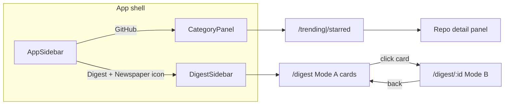

# Feature: feeds-issues-digest

**Status:** done  
**Updated:** 2026-08-13  
**Contract impact:** extends [feeds-api-v1](../spec/contracts/feeds-api-v1.md) (`type=digest`) — document when Slice 3 lands  
**Related UX:** [repo-detail-panel.md](./repo-detail-panel.md)（trending/starred 共用 master-detail 模式）  
**Prototype:** [`backend/src/collector/issues-digest.ts`](../../../backend/src/collector/issues-digest.ts)；静态快照 `frontend/public/data/digest.json` + 浏览器 live GitHub；90 日窗口 `bun run data:sync:window`

**Sources (v1):**

1. https://github.com/ruanyf/weekly/issues
2. https://github.com/GitHubDaily/GitHubDaily/issues

---

## 1. Product framing

### Positioning

第三种 feed：**社区投稿 digest / news stream**，不是 trending 仓库榜，也不是用户 starred。

| 表述 | 用 / 不用 |
|---|---|
| 「社区自荐与推荐合集」「Issues digest」「投稿动态」 | ✅ |
| 「官方周刊精选」「ruanyf weekly picks」 | ❌（除非后续按 `issue-NNN` 等编辑标签过滤） |

两板内容以 **开源自荐 / 工具自荐 / 网站自荐 / 文章推荐** 为主，含广告与自我营销噪音。产品价值是「技术圈投稿时间线」；文案与导航不要暗示编辑部策展。

### UX placement（已定）

| 决策 | 选择 |
|---|---|
| 路由 | **`/digest`**（列表）；详情态 **`/digest/$digestId`**（master-detail） |
| 导航 | **独立 Digest 产品区**：`AppSidebar` 顶级入口 + **专用 `DigestSidebar`**（替换 feeds 的 `CategoryPanel`），不是往现有 Categories 里塞第三项 |
| 卡片 | 独立 **`DigestCard`**，不复用 `FeedCard` 的 stars/forks UI |
| 正文 | Issue body **Markdown 渲染**（详情栏 / 展开态） |
| 与现有列表合并 | ❌ v1 不做 type toggle 混排 |

壳层复用：`AppSidebar` 折叠行为、`AppHeader`、主题。筛选模型独立（source / category / search / sort），不套 language / stars 区间。

---

## 2. Information architecture — Digest shell vs today’s feeds shell

### Today（feeds）

```
┌─────────────┬──────────────┬─────────────────────────────┐
│ AppSidebar  │ CategoryPanel│ AppHeader + main            │
│             │              │                             │
│ [GH] Brand  │ Categories   │ Trending / Starred          │
│ GitHub ──►  │  Trending    │ FilterBar                   │
│             │  Starred     │ FeedCard list               │
│ Settings    │              │                             │
│ Help        │              │                             │
└─────────────┴──────────────┴─────────────────────────────┘
```

代码锚点：`frontend/src/pages/__root/route.tsx` 固定渲染 `AppSidebar` + `CategoryPanel` + `Outlet`。`CategoryPanel` 仅有 Trending / Starred；`AppSidebar` 仅有一个 `GitHub` → `/trending`。

### Digest mode（目标）

进入 Digest 后，**第二栏换成专用侧栏**，第一栏增加带独立图标的 Digest 入口。不要把 Digest 当成 CategoryPanel 的第三个 `CategoryItem`。

```
┌─────────────┬──────────────────┬─────────────────────────────┐
│ AppSidebar  │ DigestSidebar    │ AppHeader + main            │
│             │                  │                             │
│ Brand       │ Digest           │ Digest / [selected title]   │
│             │ ─────────────    │                             │
│ GitHub      │ Sources          │ Mode A: DigestCard grid/list│
│ Digest ●    │  ○ All           │ Mode B: master-detail       │
│  (icon!)    │  ○ ruanyf/weekly │   left list | right MD body │
│             │  ○ GitHubDaily   │                             │
│ Settings    │ Categories       │                             │
│ Help        │  ○ All           │                             │
│             │  ○ 开源自荐      │                             │
│             │  ○ 工具自荐 …    │                             │
│             │ Quick filters    │                             │
│             │  □ Has primary   │                             │
│             │    link          │                             │
│             │ Sort             │                             │
│             │  Created / …     │                             │
└─────────────┴──────────────────┴─────────────────────────────┘
```

### AppSidebar — product switch + dedicated icon

| Item | href | Icon (lucide) | Active when |
|---|---|---|---|
| GitHub | `/trending`（或最近 feeds 路径） | `Github`（现有） | `/trending`、`/starred`、以及未来 repo detail |
| **Digest** | `/digest` | **`Newspaper`**（首选；备选 `Rss` / `MessagesSquare`） | `/digest`、`/digest/$digestId` |

**图标要求：** Digest 必须有**独立、可辨识**的图标，不复用 `Github` / `TrendingUp` / `Star`。折叠态（`collapsed`）仅显示图标，`title` tooltip = `Digest`。

实现草图：

- `AppSidebar.navItems` 增加 Digest 项。
- `__root/route.tsx`：按路径选择第二栏组件：

```ts
const isDigest = currentPath.startsWith("/digest");
// … AppSidebar …
{isDigest ? <DigestSidebar … /> : <CategoryPanel … />}
```

Header map：`/digest` → `{ title: "Digest", parent: "Community" }`；详情态可用选中 issue 短标题。

### DigestSidebar — 第二栏内容（IA）

| Section | 行为 | 绑定 filter |
|---|---|---|
| **Sources** | 单选：All / `ruanyf-weekly` / `github-daily`；展示源短名 + 可选 count | `source` |
| **Categories** | 单选：All + 从数据聚合的 category（`开源自荐` 等）；空 category 可归「未分类」 | `category` |
| **Quick filters** | v1：`Has primary link`；可选后期 `Open only` | 布尔 query 或客户端 filter |
| **Sort** | Created / Updated / Comments | `sort` + `order` |
| **Search** | 可放在侧栏顶部或主区 FilterBar；倾向主区一行 search，侧栏专注结构导航 | `search` |

侧栏**不**展示 language / stars / snapshot date（那些是 feeds 语义）。

可选组件名：`DigestSidebar`（`frontend/src/components/digest-sidebar.tsx`）。宽度可略宽于 `CategoryPanel` 的 `w-44`（例如 `w-52`），因多了 filter 控件。

---

## 3. Main content — cards + dual layout

### Mode A — Default: card list / grid

路由：`/digest`（无选中 id）。

- 一页 = **issue 卡片列表**（默认 **单列 list**，与现有 `FeedListPage` 节奏一致；宽屏可选 **2-col grid**，用 CSS `md:grid-cols-2`，v1 默认 list 即可）。
- 一卡一 issue：`DigestCard`。
- 顶部可保留轻量 search（`DigestFilterBar` 或侧栏已覆盖的补充）；**不要**塞满 feeds 的 language/stars FilterBar。

#### DigestCard 字段（摘要）

| Field | UI |
|---|---|
| `title` | 主标题（可去掉已展示的 category 前缀重复） |
| `category` | chip |
| `source` / `sourceRepo` | source badge（如 `ruanyf/weekly`） |
| `issueCreatedAt` | relative time |
| `excerpt` | 2 行 clamp |
| `primaryUrl` | 主 CTA（Visit / Open repo） |
| `issueUrl` | 次级「View on GitHub」 |
| `authorLogin` + avatar | 底部 meta |
| `comments` | 可选小计数 |

**无** stars / forks / language / topics（除非后期从关联 repo 补全，v1 不做）。

点击卡片主体 → 进入 Mode B（导航到 `/digest/$digestId`），保留当前 filters（query string 或 router search params）。

### Mode B — Master-detail（选中后）

路由：`/digest/$digestId`（`digestId` = `digest-{source}-{issue_id}`）。

```
┌──────────────────┬──────────────────────────────────────┐
│ Compact list     │ Detail pane                          │
│ (left ~36–40%)   │                                      │
│                  │ Title + category + source badges     │
│ [card summary] ● │ Meta: author · date · comments       │
│ [card summary]   │ Actions: primaryUrl · issueUrl       │
│ [card summary]   │ ───────────────────────────────────  │
│ …                │ Markdown body                        │
│                  │ (react-markdown / 现有 MD 栈)         │
│ pagination       │                                      │
└──────────────────┴──────────────────────────────────────┘
```

| 区 | 内容 |
|---|---|
| **Left** | 同一筛选结果的**精简摘要列**（标题、category chip、source、时间）；当前项高亮；滚动独立；分页或无限滚动与 Mode A 同源 |
| **Right** | 选中 issue 的 **完整 Markdown body** + 摘要头；无 body 时展示 excerpt +「Open on GitHub」 |
| **退出详情** | 关闭 / 返回按钮 → `/digest`；或 Esc；清除 `$digestId` |

移动端：详情全屏叠层或仅右栏全宽，列表用「返回」切回。

### Markdown

| 决策 | 说明 |
|---|---|
| 渲染 | Issue `body` / `body_markdown` → Markdown（GFM：链接、列表、图片、代码块） |
| 安全 | 消毒 HTML（若用允许 raw HTML 的 parser）；默认禁用 raw HTML 或 sanitize |
| 图片 | 允许 `user-attachments` / 常见 CDN；外链 `referrerpolicy` 谨慎 |
| 缺失 body | 远程详情拉取失败时降级 excerpt + issue 外链 |

列表 DTO 可只带 `excerpt`；**详情**再取 `bodyMarkdown`（见 §5 / §6），避免列表 payload 过大。

### Shared layout primitive（跨 feature）

Digest Mode B 与 [repo-detail-panel](./repo-detail-panel.md) 共用同一 **master-detail 壳**（建议组件名 `MasterDetailLayout`）：左列表槽 + 右详情槽。两处内容插槽不同（`DigestCard` vs `FeedCard` 精简行；MD issue vs README/iframe）。

---

## 4. Sample content shape（调研 2026-08-12）

| Field | ruanyf/weekly | GitHubDaily/GitHubDaily |
|---|---|---|
| Volume | ~10k issues, ~8.6k open | ~950 issues, ~760 open |
| Title pattern | `【开源自荐】…` / `【工具自荐】…` / `【网站自荐】…` / `【文章推荐】…` | `[开源自荐] …` / `【开源自荐】…` / `【推荐】…` |
| Body | Markdown；简介 + 链接 + 截图 | 同左 |
| Labels | 偶发（`weekly`；历史 `issue-NNN` = 周刊期号） | 通常空 |
| Primary link | 正文首个非附件 URL；常为 `github.com/owner/repo` | 同左；约 90% 含 GitHub URL |
| Authors | 大量独立提交者 | 同左 |

API 探测（已验证可用）：

```bash
gh api "repos/ruanyf/weekly/issues?state=all&per_page=30&sort=created&direction=desc"
gh api "repos/GitHubDaily/GitHubDaily/issues?state=all&per_page=30&sort=created&direction=desc"
# Incremental:
gh api "repos/ruanyf/weekly/issues?state=all&per_page=100&since=2026-08-01T00:00:00Z&sort=updated"
```

**必过滤：** GitHub list-issues **含 PR**。丢弃带 `pull_request` 字段的条目（原型已实现）。

---

## 5. Data strategy — remote + local

### 原则

| 模式 | 用途 |
|---|---|
| **Remote-first（浏览）** | UI / API 可直接经 backend 调 `gh api` 拉列表与单条 body（开发态、未 sync 时也能看） |
| **Local persist（脚本）** | CLI 全量/增量写入 **SQLite**；可选再 **export JSON** 供静态站 |

两者并存：sync 填本地；API 读本地优先，miss 时可 remote fallback（实现时二选一，见 Open Q）。

### Intended CLI / script paths（协调并行 data agent）

**勿抢改**并行中的 `sync.ts` / live server；接线顺序以本表为准，agent 之间用路径对齐：

| Intent | Path / command | Notes |
|---|---|---|
| Collector（已有） | `backend/src/collector/issues-digest.ts` | remote fetch + normalize + JSON persist |
| Sync orchestration | 未来 `syncDigestSources()`；**接线 `sync.ts` 须等 trending 修复落地** | — |
| CLI sync / local JSON | `bun run sync:digest` / `bun run export:digest-local` | 同 `cli.ts sync digest`；**v1 写 JSON，不碰 trending schema** |
| CLI 增量 | `… --since YYYY-MM-DD` / `--until` / `--created-only` / `--out DIR` / `--source ID` | Issues API `since` = updated_at |
| Export（静态站） | `bun run export:digest` | Slice 5；chunks + manifest |
| DB | `digest_items` + `digest_sync_state` in `schema.sql` | 见 §6（后置） |
| JSON 落盘（v1） | `~/.innate/digest/digest-*.json`（`--out` 可改，如 `backend/data/digest`） | 含 `bodyMarkdown`；SQLite upsert 后置 |

```bash
cd backend
# August dump (updated since 2026-08-01) → ~/.innate/digest/
bun run sync:digest -- --since 2026-08-01
# Created-in-August only:
bun run export:digest-local -- --since 2026-08-01 --until 2026-09-01 --created-only
# Also copy under repo:
bun run sync:digest -- --since 2026-08-01 --out ./data/digest

bunx tsx src/collector/issues-digest.ts --limit 20
bunx tsx src/collector/issues-digest.ts --since 2026-08-01 --save
```

**Auth:** Prefer `gh api`（5k/hr）。若 keyring token 无效，collector **fallback 到 public `fetch`**（60/hr）——公开 Issues 板仍可用；August 体量约 3 页，足够。

### Remote fetch（无本地或详情补全）

| Call | Endpoint |
|---|---|
| List | `GET /repos/{owner}/{repo}/issues`（同 collector） |
| Single body | list 已含 `body`；若列表省略 body，则 `GET /repos/{owner}/{repo}/issues/{number}` |

Backend 封装在 collector：先 `execFileSync("gh", ["api", …])`，失败则 public REST `fetch`；禁止 shell 拼接。

---

## 6. Data model

### 原则

- **新表**，不塞进 `trending_repos` / `starred_repos`。
- 行粒度 = **一条源 Issue**（跨板同一项目可存两行）。
- 主键用稳定文本 id；GitHub global `issue_id` 另做 UNIQUE，便于 upsert。

### Schema（实现时写入 `backend/src/db/schema.sql`）

```sql
CREATE TABLE IF NOT EXISTS digest_items (
  id TEXT PRIMARY KEY,                 -- digest-{source}-{issue_id}
  source TEXT NOT NULL,                -- 'ruanyf-weekly' | 'github-daily'
  source_repo TEXT NOT NULL,           -- 'ruanyf/weekly'
  issue_number INTEGER NOT NULL,
  issue_id INTEGER NOT NULL UNIQUE,    -- GitHub global issue id
  title TEXT NOT NULL,
  category TEXT,                       -- parsed from 【…】 / […]
  body_markdown TEXT,                  -- preferred for detail pane; may be null until detail fetch
  body_excerpt TEXT,                   -- ~280 chars, stripped
  primary_url TEXT,
  github_repo_full_name TEXT,          -- nullable
  author_login TEXT NOT NULL,
  author_avatar_url TEXT,
  issue_url TEXT NOT NULL,
  state TEXT NOT NULL,                 -- open | closed
  labels_json TEXT NOT NULL DEFAULT '[]',
  comments INTEGER NOT NULL DEFAULT 0,
  issue_created_at TEXT NOT NULL,
  issue_updated_at TEXT NOT NULL,
  fetched_at TEXT NOT NULL DEFAULT (datetime('now')),
  UNIQUE(source, issue_number)
);

CREATE INDEX IF NOT EXISTS idx_digest_items_created ON digest_items(issue_created_at DESC);
CREATE INDEX IF NOT EXISTS idx_digest_items_updated ON digest_items(issue_updated_at DESC);
CREATE INDEX IF NOT EXISTS idx_digest_items_source ON digest_items(source);
CREATE INDEX IF NOT EXISTS idx_digest_items_category ON digest_items(category);
CREATE INDEX IF NOT EXISTS idx_digest_items_gh_repo ON digest_items(github_repo_full_name);

CREATE TABLE IF NOT EXISTS digest_sync_state (
  source TEXT PRIMARY KEY,
  last_since TEXT,                     -- ISO8601 for Issues API `since`
  last_synced_at TEXT NOT NULL
);
```

### Field notes

| Field | Rule |
|---|---|
| `id` | `digest-{source}-{issue_id}`，与原型一致 |
| `category` | `^[\[【]([^\]】]+)[\]】]`；无匹配则为 `NULL` |
| `body_markdown` | **详情 UX 需要**；sync 可存全文，或列表只存 excerpt、详情 remote/按需写入。体积大时：sync 默认存 excerpt + 可选 `--with-body` |
| `primary_url` / `github_repo_full_name` | 见 collector 解析规则；可均为 null |

### Dedupe strategy

| 层级 | v1 | Later |
|---|---|---|
| 同板重复同步 | Upsert by `issue_id`（及 `source+issue_number`） | — |
| **跨板同一项目** | **存两行**；列表默认按时间混排，双 source badge | UI 按 `github_repo_full_name` 折叠 |
| 跨板无 GitHub 链接 | 无法可靠去重；保留两行 | 可选 fuzzy title |

**不在 v1 做：** 用 `github_repo_full_name` 关联 `starred_repos` 补 stars/language。

---

## 7. Collector / sync

### Module boundaries

| Piece | Path / note |
|---|---|
| Fetch + normalize | `backend/src/collector/issues-digest.ts`（已有原型） |
| Orchestration | 未来 `syncDigestSources()`；**接线 `sync.ts` / CLI 须等并行 trending 修复落地后再动** |
| Transport | `gh api` + `execFileSync`（与 `github.ts` 同模式，无 HTML scrape） |
| Firecrawl | **不使用** |

### Fetch rules

| Concern | Decision |
|---|---|
| Endpoint | `GET /repos/{owner}/{repo}/issues` |
| PR filter | `if (issue.pull_request) skip` |
| Incremental | Per-source `digest_sync_state.last_since` → `?since=&sort=updated`；成功后推进 `last_since`（倾向 **sync start ISO**） |
| Backfill | 首次：建议 **90 天且硬顶 500 条/源**——ruanyf open 量过大，禁止无上限全量 |
| Schedule | 本地可 1–6h；静态站日更流水线跟一次 |
| Rate limit | 2 源 × 少页；远低于认证 REST 5k/hr |
| State | 默认同步 `state=all`；UI 可只展示近期 |

### Parsing（与原型对齐）

1. **Category：** title 前缀 `【…】` / `[…]`
2. **URLs：** body 中 `https?://…`，去掉尾标点与 `&amp;`
3. **丢弃：** `user-attachments`、`camo.githubusercontent.com`、`avatars.githubusercontent.com`（解析 primary 时；**渲染 Markdown 图片时仍允许显示**）
4. **GitHub repo：** 首个 `github.com/owner/repo` 且 `owner/repo ≠ source_repo`
5. **primary_url：** 优先规范化 `https://github.com/{full}`；否则首个可用外链

---

## 8. API surface

### Decision（已定）

**扩展现有列表：** `GET /api/feeds?type=digest`，不另开 `/api/digest/*`（详情可加薄端点）。

| Change | Detail |
|---|---|
| `GET /api/feeds?type=digest` | 新增 type；静默忽略 `language` / `topics` / `stars*` / `date` |
| Query（digest） | `search`、`source`、`category`、`sort`=`created`\|`updated`\|`comments`、`order`、`page`、`pageSize`；可选 `hasPrimaryUrl=1` |
| List DTO | `DigestFeedItem`（见下）；列表可省略或截断 `bodyMarkdown` |
| Detail | `GET /api/feeds/digest/:id` → 含完整 `bodyMarkdown`（本地 miss 则 remote fetch 可选） |
| `POST /api/feeds/sync` | `type: "digest"`；可选 `sources?`、`since?`、`force?` |
| Stats | 可选 `digestCount` |
| Meta | v1 前端可写死 sources；categories 从 SQL `DISTINCT` 或列表聚合 |

### DTO

```ts
interface DigestFeedItem {
  id: string;
  type: "digest";
  source: "ruanyf-weekly" | "github-daily";
  sourceRepo: string;
  title: string;
  category: string | null;
  excerpt: string;
  bodyMarkdown?: string | null; // list optional; detail required when available
  primaryUrl: string | null;
  githubRepoFullName: string | null;
  issueUrl: string;
  authorLogin: string;
  authorAvatarUrl: string | null;
  issueCreatedAt: string;
  issueUpdatedAt: string;
  labels: string[];
  comments: number;
  state: "open" | "closed" | string;
  fetchedAt: string;
}
```

**Contract：** Slice 3 更新 `feeds-api-v1.md`（`type=digest` + detail）；trending/starred 不变。

---

## 9. Frontend（实现草图）

| Item | Decision |
|---|---|
| Routes | `pages/digest/`：`/digest`、`/digest/$digestId`；`router.tsx` 注册 |
| Shell | `__root`：digest 路径渲染 `DigestSidebar` 替代 `CategoryPanel` |
| AppSidebar | 增加 Digest + **`Newspaper` 图标** |
| Card | `DigestCard` |
| Layout | Mode A list；Mode B `MasterDetailLayout` |
| MD | 详情栏 `DigestMarkdown`（封装 markdown 组件 + sanitize） |
| Filters | 侧栏为主；主区 search 可选 `DigestFilterBar` |
| Client | `services/feeds.ts`：`type: "digest"` + `fetchDigestDetail(id)` |
| Types | `types/feed.ts` 联合扩展 |

**不要做：** 把 digest 行映射成假 `FeedItem` 骗过 `FeedCard`。

### Wireframe — Mode A

```
┌────┬─────────────┬─────────────────────────────────────┐
│ GH │ Digest      │ Community > Digest                  │
│ 📰 │ Sources     │ [search……………………]                    │
│    │  ● All      │                                     │
│    │  ○ ruanyf   │ ┌─────────────────────────────────┐ │
│    │  ○ Daily    │ │ [开源自荐] ruanyf/weekly   2h   │ │
│    │ Categories  │ │ Title of the submission…        │ │
│    │  ● All      │ │ Excerpt line…                   │ │
│    │  ○ 开源…    │ │ [Open link]  ·  @author         │ │
│    │ Sort: New   │ └─────────────────────────────────┘ │
│    │             │ ┌─────────────────────────────────┐ │
│    │             │ │ … next DigestCard …             │ │
│    │             │ └─────────────────────────────────┘ │
└────┴─────────────┴─────────────────────────────────────┘
```

### Wireframe — Mode B

```
┌────┬─────────────┬──────────────────┬──────────────────┐
│ 📰 │ Sources…    │ · Title A      ● │ # Full title     │
│    │ Categories… │ · Title B        │ badges · meta    │
│    │             │ · Title C        │ [primary] [gh]   │
│    │             │ · …              │ ───────────────  │
│    │             │                  │ markdown body…   │
│    │             │                  │ ![img] …         │
└────┴─────────────┴──────────────────┴──────────────────┘
```

### Mermaid — navigation states



---

## 10. Static export impact

**Phase 延后（Slice 5）。** API 模式先上线。

- Chunk：`digest-YYYY-MM-DD.json`（或按源）+ `manifest.json`
- 客户端：`/digest` 加载并过滤；详情依赖 chunk 内 `bodyMarkdown` 或省略后外链
- 日调度：`sync:digest` → `export:digest`
- 体量：注意全文 body；可 export 截断或详情-only 文件

---

## 11. Phased implementation + acceptance

### Phase 0 — Prototype（done）

- [x] 调研两源 Issues 与 API
- [x] 独立 collector `issues-digest.ts`
- [x] 本设计文档（含专用 sidebar + dual layout）
- [x] **未**改 `schema.sql` / `sync.ts` / `server.ts` / frontend（避让并行 trending）

### Phase 1 — Schema + CLI sync（Slice 2）

- [ ] `digest_items` + `digest_sync_state`；CRUD
- [ ] CLI `sync digest` / `bun run sync:digest`；增量 upsert；PR 过滤
- [ ] **最小**改 `cli.ts` / `package.json`；`sync.ts` 仅在 trending 修复合并后接线
- [ ] 明确 `body_markdown` 是否默认落库（建议：excerpt 必存；body 用 `--with-body` 或详情按需）

### Phase 2 — API（Slice 3）

- [ ] `GET /api/feeds?type=digest` + pagination / filters
- [ ] `GET /api/feeds/digest/:id` 含 markdown body
- [ ] `POST /api/feeds/sync` `type: digest`
- [ ] Contract 文档更新

### Phase 3 — UI shell + list（Slice 4a）

- [ ] AppSidebar Digest 入口 + **Newspaper（或等价）专用图标**
- [ ] `DigestSidebar` 替换 CategoryPanel（仅 `/digest*`）
- [ ] `/digest` Mode A：`DigestCard` 列表；无 stars UI
- [ ] 筛选 / 空态

### Phase 4 — Master-detail + Markdown（Slice 4b）

- [ ] `/digest/$digestId` Mode B
- [ ] 右栏 Markdown 渲染 + sanitize
- [ ] 与 [repo-detail-panel](./repo-detail-panel.md) 共享 `MasterDetailLayout`（可同 PR 或紧随）

### Phase 5 — Static（Slice 5，可选）

- [ ] `export:digest` + manifest；静态模式可读

---

## 12. Open questions / risks

| # | Topic | Notes | Bias |
|---|---|---|---|
| 1 | 产品文案 | Digest vs 投稿 | 英文 Digest；中文「投稿」 |
| 2 | Spam | 自荐板含广告 | v1 全量；后期可过滤 |
| 3 | Backfill | 90d vs 500/源 | **90d 且硬顶 500/源** |
| 4 | `last_since` | max(updated) vs sync start | **sync start ISO** |
| 5 | `body_markdown` 存否 | 体积 vs 详情 | **详情需要 MD**；sync 默认可只存 excerpt，详情 API remote/按需缓存 |
| 6 | 跨板 UI 去重 | 双行 vs 折叠 | v1 双行 |
| 7 | 并行冲突 | trending 占用 sync/server | digest 接线排后；文档/原型/schema 可并行 |
| 8 | 源扩展 | 更多 Issues 板 | `DIGEST_SOURCES` 配置化 |
| 9 | 列表读路径 | 仅本地 vs remote fallback | API 模式：**本地优先**；空库时提示先 `sync:digest` 或提供「Fetch remote」开发开关 |
| 10 | 第二栏宽度 | `w-44` vs 更宽 | DigestSidebar **`w-52`** |
| 11 | Grid vs list | Mode A 默认 | **list**；grid 可选后续 |
| 12 | 图标最终选择 | Newspaper / Rss | **Newspaper** |

---

## 13. Related code

| Piece | Path | Status |
|---|---|---|
| Feature doc | `docs/project/features/feeds-issues-digest.md` | 本文 |
| Repo detail UX | `docs/project/features/repo-detail-panel.md` | 姊妹设计 |
| Feature index | `docs/project/features/README.md` | proposed |
| Prototype collector | `backend/src/collector/issues-digest.ts` | done（standalone） |
| Schema / DB / sync wiring | `schema.sql`、`db/index.ts`、`sync.ts` | later（避让冲突） |
| CLI | `sync:digest` / `export:digest` | later |
| API | `server.ts` | later |
| UI | `pages/digest/`、`digest-sidebar.tsx`、`digest-card.tsx`、`MasterDetailLayout` | later |

---

## Verdict

**可行。** Digest 是独立产品区：AppSidebar 专用图标入口 + `DigestSidebar`（sources / categories / filters），主区 Mode A 卡片列表 → Mode B master-detail + Markdown。数据 remote（`gh`）可浏览，CLI `sync:digest` / 可选 `export:digest` 持久化。实现上新表 + `type=digest` + `/digest`；**勿在并行 trending 修复完成前强行改 `sync.ts` / `server.ts`。**
