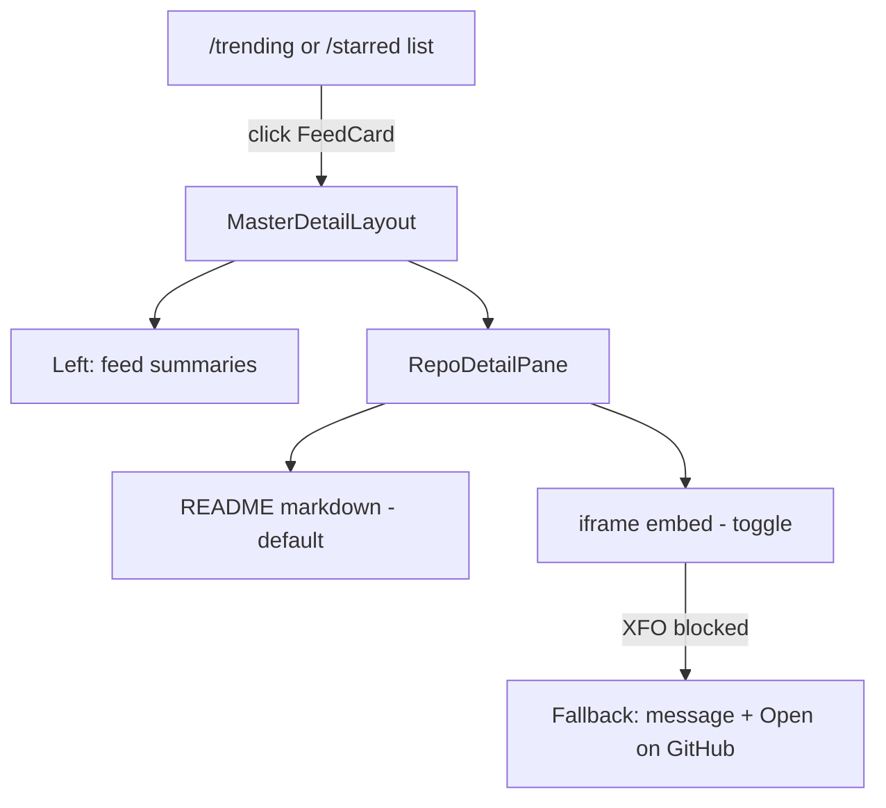

# Feature: repo-detail-panel

**Status:** proposed  
**Updated:** 2026-08-12  
**Depends on UX pattern:** [feeds-issues-digest.md](./feeds-issues-digest.md) §3 Mode B（共用 master-detail）  
**Surfaces:** `/trending`、`/starred`（feeds 壳层，**不是** DigestSidebar）

---

## 1. Product framing

用户在 Trending / Starred 列表中点击某个仓库后，进入与 Digest 相同的 **master-detail** 体验：

- **左：** 当前 feed 上下文的仓库摘要列表（保留筛选结果）
- **右：** 仓库「详情」——默认渲染 **README Markdown**；可选切换为 **GitHub 页面 iframe**（或 iframe 失败时的降级）

目标：在应用内快速扫 README / 仓库首页，减少来回跳转浏览器标签；外链「Open on GitHub」始终保留。

---

## 2. Placement in today’s shell

今日布局（不变）：

```
AppSidebar (GitHub) → CategoryPanel (Trending|Starred) → Header + list
```

详情态**不**换第二栏；仍用 `CategoryPanel`。仅主内容区从单列 `FeedListPage` 切到 `MasterDetailLayout`。

| 路由（建议） | 含义 |
|---|---|
| `/trending` | Mode A：现有 FeedCard 列表 |
| `/trending/$repoId` 或 `?repo=` | Mode B：master-detail（trending 上下文） |
| `/starred` / `/starred/$repoId` | 同理 starred 上下文 |

`repoId` 可用 GitHub numeric id 或 `owner%2Fname`；实现时与现有 `FeedItem.id` / `repo.fullName` 对齐即可。**Digest 路由保持 `/digest/$digestId`，互不混用。**

点击行为变更（相对今日）：

| 今日 | 目标 |
|---|---|
| 标题/外链 → `target=_blank` 打开 GitHub | 卡片主体 → 应用内详情；外链图标仍 `_blank` |
| 无应用内详情 | Mode B 右栏 README 或 iframe |

---

## 3. Layout

### Mode A（默认，现有）

单列 / 列表：`FilterBar` + `FeedCard`（`FeedListPage`）。

### Mode B — Master-detail

```
┌────────────────────────┬─────────────────────────────────────┐
│ Repo summary list      │ Detail chrome                       │
│ (left ~36–40%)         │ fullName · stars · language         │
│                        │ [README ●] [Embed] [Open ↗]         │
│ FeedCard compact ●     │ ─────────────────────────────────── │
│ FeedCard compact       │ Pane: Markdown README  |  or iframe │
│ …                      │                                     │
└────────────────────────┴─────────────────────────────────────┘
```

| Zone | Content |
|---|---|
| Left | 精简行：avatar、fullName、description clamp、stars；当前选中高亮；同源分页/筛选 |
| Right chrome | 仓库 meta + **视图切换**：`README` \| `GitHub page` + 外链 |
| Right body | 见 §4 |
| Back | 返回 Mode A（清 `$repoId`）；Esc |

与 Digest 共用建议组件：`MasterDetailLayout`（左 slot / 右 slot）。右栏 feeds 专用：`RepoDetailPane`。

### Mermaid



---

## 4. Detail pane options

### Option A — README Markdown（**推荐默认**）

| 项 | 说明 |
|---|---|
| UX | 应用内可读、主题一致、可滚动、无第三方 chrome |
| CSP | 自渲染 HTML/MD，不依赖嵌入 github.com；图片走 `raw.githubusercontent.com` / camo 时注意 CSP `img-src` |
| 空 README | 展示「No README」+ 描述 + 外链 |
| 非 Markdown | 少数 README.rst 等 → 提示仅支持 MD，或纯文本降级 |

#### Fetch paths（backend 优先，避免前端裸 token）

| Method | Command / URL | Notes |
|---|---|---|
| **Preferred** | `gh api repos/{owner}/{repo}/readme` | 返回 JSON：`content`（base64）、`encoding`、`download_url`、`name` |
| Decode | `Buffer.from(content, "base64").toString("utf8")` | 目录 README 选择由 GitHub API 决定（根 README） |
| Alt | `gh api repos/{owner}/{repo}/contents/README.md` | 需自行尝试 README.md / readme.md |
| Raw | `https://raw.githubusercontent.com/{owner}/{repo}/{ref}/README.md` | 需 default branch；无认证易限流；适合静态镜像 |
| HTML 渲染（可选） | Accept `application/vnd.github.html` on readme API | 得到 GitHub 渲染 HTML；需 sanitize，主题难统一 → **v1 偏向自渲染 MD** |

API 草图：

```http
GET /api/repos/:owner/:repo/readme
→ { fullName, ref, name, markdown: string, htmlUrl: string }
```

缓存：内存 / SQLite 短缓存（按 `full_name` + `pushed_at` 或 ETag）；勿把巨大 README 永久塞进 trending 行。

前端：与 Digest 相同 Markdown 栈（GFM + sanitize）。相对链接可解析为 `https://github.com/{owner}/{repo}/blob/{ref}/…`（尽力而为）。

### Option B — iframe 嵌入 GitHub 页

| 项 | 说明 |
|---|---|
| URL | `https://github.com/{owner}/{repo}`（或 `/blob/…/README.md`） |
| UX | 「完整 GitHub 站」；含 Issues/Stars UI，但视觉割裂、双滚动条 |
| **Risk** | GitHub 响应常带 **`X-Frame-Options: deny`**（或 CSP `frame-ancestors`），**主流浏览器会拒绝嵌入** → 空白框 |
| 何时用 | 用户显式切到 Embed；或 README 拉取失败时的「尝试嵌入」；失败则立刻 fallback UI |

Fallback UI（必做）：

```
GitHub won’t allow embedding this page.
[Open on GitHub ↗]   [Switch to README]
```

**不要**为绕过 XFO 做代理整页 HTML 抓取（脆、重、ToS/安全风险）。

### Recommendation（已定默认）

| 选择 | 理由 |
|---|---|
| **默认：README Markdown** | 可控、可读、CSP 友好、不受 XFO 影响 |
| **次要：iframe toggle** | 满足「看完整 GitHub 页」诉求；接受高失败率并做好 fallback |
| **持久化偏好** | `localStorage` key：`repo-detail-view=readme|iframe`（可选） |

---

## 5. Wireframes (ASCII)

### README default

```
┌────┬──────────┬────────────────────┬──────────────────────────┐
│ GH │ Trending │ owner/repo-a     ● │ owner/repo-a             │
│    │ Starred  │ owner/repo-b       │ ★ 12k · TypeScript       │
│    │          │ owner/repo-c       │ [README ●] [Embed] [↗]   │
│    │          │ …                  │ ───────────────────────  │
│    │          │                    │ # repo-a                 │
│    │          │                    │ Install…                 │
│    │          │                    │ ```bash                  │
│    │          │                    │ npm i repo-a             │
└────┴──────────┴────────────────────┴──────────────────────────┘
```

### iframe blocked

```
│ … list … │ [README] [Embed ●] [↗]                              │
│          │ ┌────────────────────────────────────────────────┐  │
│          │ │ (blank / browser block)                        │  │
│          │ │ GitHub won’t allow embedding this page.        │  │
│          │ │ [Open on GitHub]  [Switch to README]           │  │
│          │ └────────────────────────────────────────────────┘  │
```

---

## 6. API / data (implementation-ready sketch)

| Endpoint | Purpose |
|---|---|
| Existing `GET /api/feeds?type=trending\|starred` | 左栏列表数据（不变） |
| **New** `GET /api/repos/:owner/:repo/readme` | README markdown + meta |
| Optional | `GET /api/repos/:owner/:repo` 轻量 repo meta（若列表行不足） |

**Static mode：** export 时一般**不**打包全量 README；详情态要么运行时不可用并引导外链，要么按「当前快照仓库子集」增量缓存（后期）。v1 API 模式先做。

**CLI（可选，非阻塞）：** `bunx tsx … fetch-readme owner/repo` 仅调试；无需与 digest sync 抢 `sync.ts`。

安全：

- `owner` / `repo` 校验 `/^[\w.-]+$/`
- 仍用 `gh api` + `execFileSync` 参数数组
- Markdown sanitize；限制 `javascript:` URL

---

## 7. Frontend sketch

| Piece | Path / name |
|---|---|
| Shared layout | `components/master-detail-layout.tsx` |
| Detail pane | `components/repo-detail-pane.tsx` |
| View toggle | README \| Embed |
| Markdown | 与 Digest 共用 `MarkdownBody` |
| Routes | `trending` / `starred` 子路由或 search param |
| Card click | `FeedCard`：`onSelect(item)` → navigate；外链按钮 `stopPropagation` |

`CategoryPanel` / `AppSidebar`：**无** Digest 图标逻辑；feeds 保持 `Github` + Trending/Starred。

---

## 8. Phased plan

### Phase 0 — Design（this doc）

- [x] 双选项 + 默认 README
- [x] XFO 风险与 fallback
- [x] 与 Digest master-detail 对齐

### Phase 1 — Shared layout + routing

- [ ] `MasterDetailLayout`
- [ ] `/trending/$repoId`（及 starred）进出 Mode B
- [ ] `FeedCard` 可选择中态；外链不抢点击

### Phase 2 — README pipeline

- [ ] Backend `GET …/readme` via `gh api repos/…/readme`
- [ ] 前端 Markdown 渲染 + 空态 / 错误态
- [ ] 基础缓存

### Phase 3 — iframe toggle + fallback

- [ ] Embed 切换
- [ ] 检测加载失败 / 假设 XFO 失败时的明确 CTA（不能 100% 检测时：短超时 + 「若空白则…」文案）

### Phase 4 — Polish（可选）

- [ ] localStorage 视图偏好
- [ ] README 相对链接重写
- [ ] Static mode 策略

---

## 9. Open questions

| # | Topic | Bias |
|---|---|---|
| 1 | 路由用 path param 还是 `?repo=` | **path param**，与 digest 一致、可分享 |
| 2 | README 用 GitHub HTML vs 自渲染 MD | **自渲染 MD** |
| 3 | iframe 失败检测 | 短超时 + 常驻 fallback 文案；不依赖可靠 onError |
| 4 | 默认 branch / monorepo 子 README | 跟 GitHub readme API 默认；子路径 v2 |
| 5 | 与 Digest 共享 Markdown 依赖 | **同一组件**，一次引入 |
| 6 | 是否在卡片上预取 README | v1 **否**（点击再拉） |
| 7 | Contract 文档 | 新 endpoint 记入 `feeds-api-v1` 附录或小版 v1.2 |

---

## 10. Related

| Doc / code | Role |
|---|---|
| [feeds-issues-digest.md](./feeds-issues-digest.md) | 同源 master-detail；Digest 侧栏不同 |
| [feeds-trending.md](./feeds-trending.md) / [feeds-starred.md](./feeds-starred.md) | 列表上下文 |
| [ui-shell.md](./ui-shell.md) | 三栏壳；详情不改 CategoryPanel |
| `frontend/src/components/feed-card.tsx` | 点击进入详情 |
| `frontend/src/pages/trending/`、`starred/` | 路由承载 |
| Backend readme helper | later：`collector/github.ts` 或 `app/server.ts` 薄封装 |

---

## Verdict

**默认 README Markdown**（`gh api …/readme` → 自渲染）；**iframe 为显式 toggle + XFO fallback**。主区 master-detail 与 Digest Mode B 同壳、不同侧栏与数据。v1 先做 API 模式；静态全量 README 后置。
