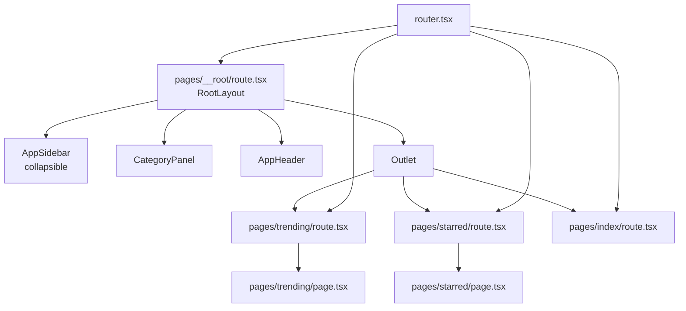

# UI Layout Task 3 — Sidebar 优化 + 前端代码重构

本图描述 Task 3 的改造方案：可折叠 Sidebar、分类移至中间栏、前端目录按页面重组。

## 页面结构

```
┌────────────────────────────────────────────────────────────────────────────────────┐
│  [≡]  Innate Feeds    GitHub / Trending                              User          │  ← Header
├──────────┬─────────────────┬───────────────────────────────────────────────────────┤
│          │                 │                                                       │
│  Collapsed│  Middle Column  │              Right Column                             │
│   or     │  (Category Panel)│           (Category Content)                          │
│  Expanded│                 │                                                       │
│          │  ┌───────────┐  │  ┌─────────────────────────────────────────────────┐  │
│  [≡]     │  │ Trending  │  │  │ Header + Stats + Filter + Feed List + Pagination│  │
│  GitHub  │  │  active   │  │  └─────────────────────────────────────────────────┘  │
│          │  └───────────┘  │                                                       │
│  [⚙]     │                 │                                                       │
│  [?]     │  ┌───────────┐  │                                                       │
│          │  │  Starred  │  │                                                       │
│          │  │           │  │                                                       │
│          │  └───────────┘  │                                                       │
│          │                 │                                                       │
└──────────┴─────────────────┴───────────────────────────────────────────────────────┘
```

Collapsed Sidebar 形态：

```
┌────┬─────────────────┬──────────────────────────────────────────┐
│[≡] │                 │                                          │
│ ⚙  │  Middle Column  │           Right Column                   │
│ ?  │  (Category Panel)│         (Category Content)              │
└────┴─────────────────┴──────────────────────────────────────────┘
```

## 组件层级



## 目录结构

```
frontend/src/
├── components/              # 共享组件
│   ├── app-header.tsx
│   ├── app-sidebar.tsx
│   ├── category-panel.tsx
│   ├── feed-card.tsx
│   ├── filter-bar.tsx
│   └── stats-cards.tsx
├── pages/                   # 按页面组织的目录
│   ├── __root/
│   │   └── route.tsx        # 根布局（含 Outlet）
│   ├── index/
│   │   └── route.tsx        # / 重定向到 /trending
│   ├── trending/
│   │   ├── route.tsx        # Trending 路由定义
│   │   └── page.tsx         # Trending 页面内容
│   └── starred/
│       ├── route.tsx        # Starred 路由定义
│       └── page.tsx         # Starred 页面内容
├── router.tsx               # 从 pages/ 加载所有路由
├── main.tsx
└── styles.css
```

## 路由映射

| Route Path | Sidebar Active | Middle Active | Right Content |
|---|---|---|---|
| `/` | GitHub | Trending | Redirect to `/trending` |
| `/trending` | GitHub | Trending | Trending feed list |
| `/starred` | GitHub | Starred | Starred feed list |

## Sidebar 折叠规则

- 默认展开（`w-64`）
- 点击顶部或底部折叠按钮后收起为 `w-16`
- 收起后仅显示图标和 Logo 图标
- 再次点击恢复展开
